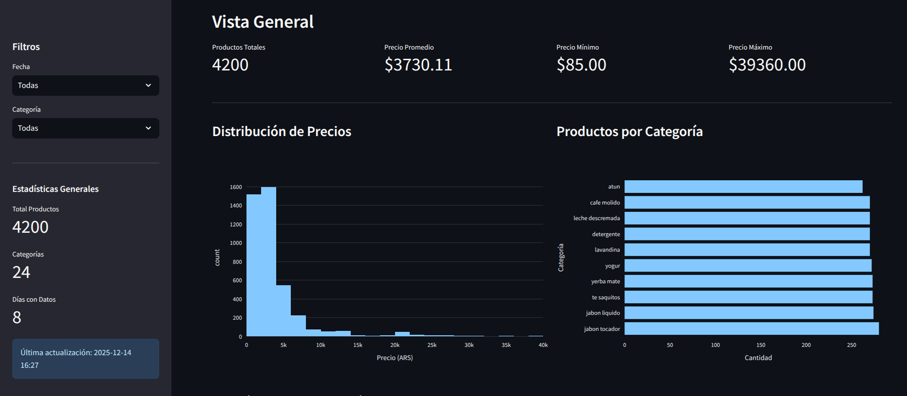
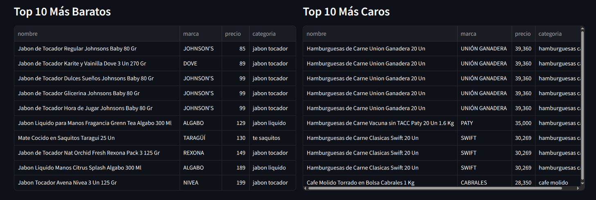
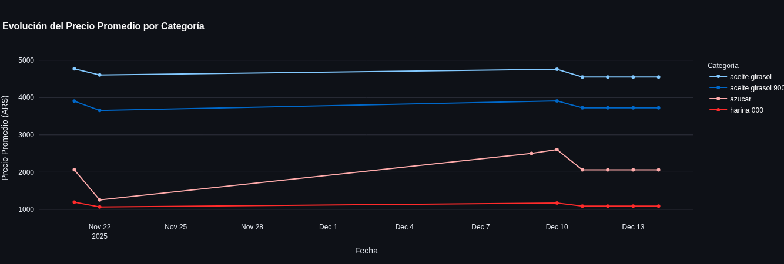

# 📊 Price Monitor Dashboard (Mar del Plata)

Dashboard interactivo para el análisis y monitoreo de precios y canasta básica, desarrollado en **Python** con **Streamlit** y **Pandas**, y desplegado en **Render**.

---

## Demo en vivo

🔗 **App online:** [https://price-monitor-2-l280.onrender.com](https://price-monitor.onrender.com)
_(si está en modo free, puede tardar unos segundos en iniciar)_

---

## Capturas del Dashboard

### Vista general



### Top de precios



### Evolución de precios



---

## Características principales

- Web Scraping con API de Precios Claros
- Visualización interactiva de precios
- Filtro por fechas disponibles
- Análisis de canasta básica
- Procesamiento de datos con **Pandas**
- Interfaz web simple y responsive con **Streamlit**
- Deploy automático en **Render**

---

## Stack tecnológico

- **Python 3.11**
- **Streamlit 1.29**
- **Pandas**
- **NumPy**
- **Render** (deploy)

---

## Estructura del proyecto

```text
price-monitor/
├── analysis/
│   └── dashboard.py        # App principal de Streamlit
├── data/
│   └── precios.csv       # Dataset (ejemplo)
├── images/                 # Imágenes para el README
├── requirements.txt
├── runtime.txt             # Versión de Python para Render
└── README.md
```

---

## Instalación local

Cloná el repositorio:

```bash
git clone https://github.com/tachyon-lhc/price-monitor.git
cd price-monitor
```

Creá un entorno virtual e instalá dependencias:

```bash
python -m venv .venv
source .venv/bin/activate  # Linux / Mac
pip install -r requirements.txt
```

Ejecutá la app:

```bash
streamlit run analysis/dashboard.py
```

---

## Deploy en Render

El proyecto está configurado para desplegarse automáticamente en Render.

**Start Command:**

```bash
streamlit run analysis/dashboard.py \
  --server.port $PORT \
  --server.address 0.0.0.0
```

**Runtime:**

```txt
python-3.11.9
```

---

## ⚠️ Notas importantes

- El dashboard asume que los datos ya están generados.
- No se recomienda ejecutar scraping directamente en producción.
- En entornos free, Render puede suspender la app tras inactividad.
- En entornos free, tampoco puedo crear un worker con el scheduler.

---

## Roadmap

- [ ] Scheduler para recolectar datos automaticamente
- [ ] Agregar más métricas de canasta básica
- [ ] Exportación de datos
- [ ] Persistencia en base de datos
- [ ] Autenticación de usuarios

---

## Autor

## **Valentín González Daumes**
